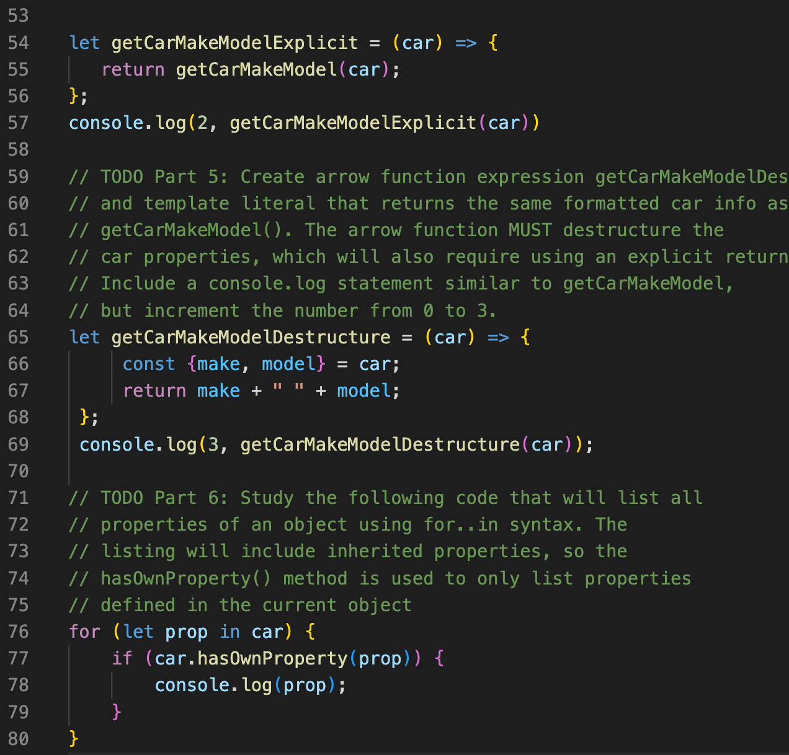

# cit281-lab-3

[cit281 lab-3](https://github.com/UO-CIT-qiqima/cit281-lab-3)

Lab 3:
1. I practice to destructure an object.
2. I practice arrow function expressions.
3. I practice to use for..in syntax.
4. I practice to use module.exports and require().
5. I learn more about the spread operator.

